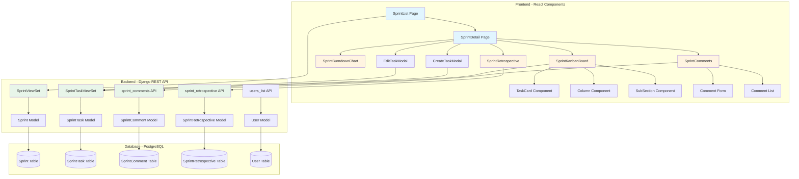
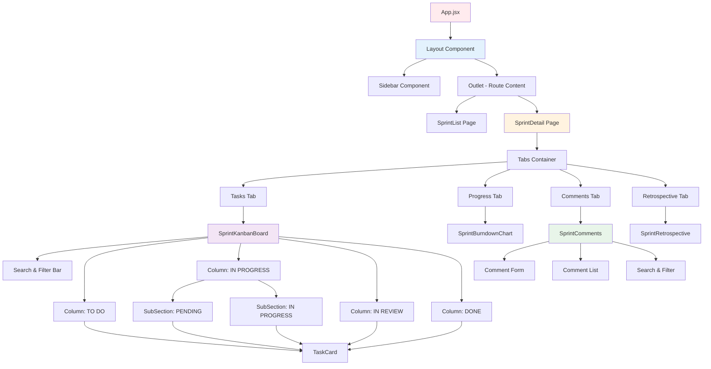
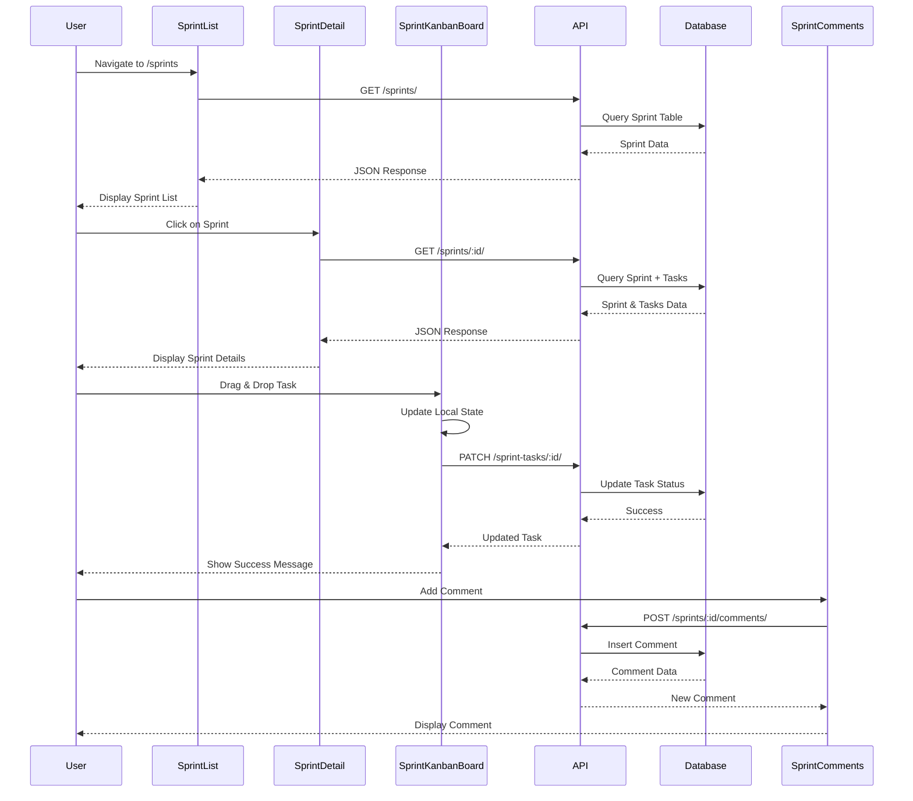
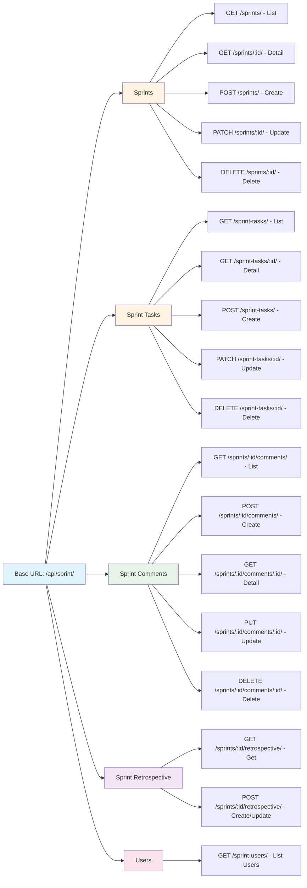
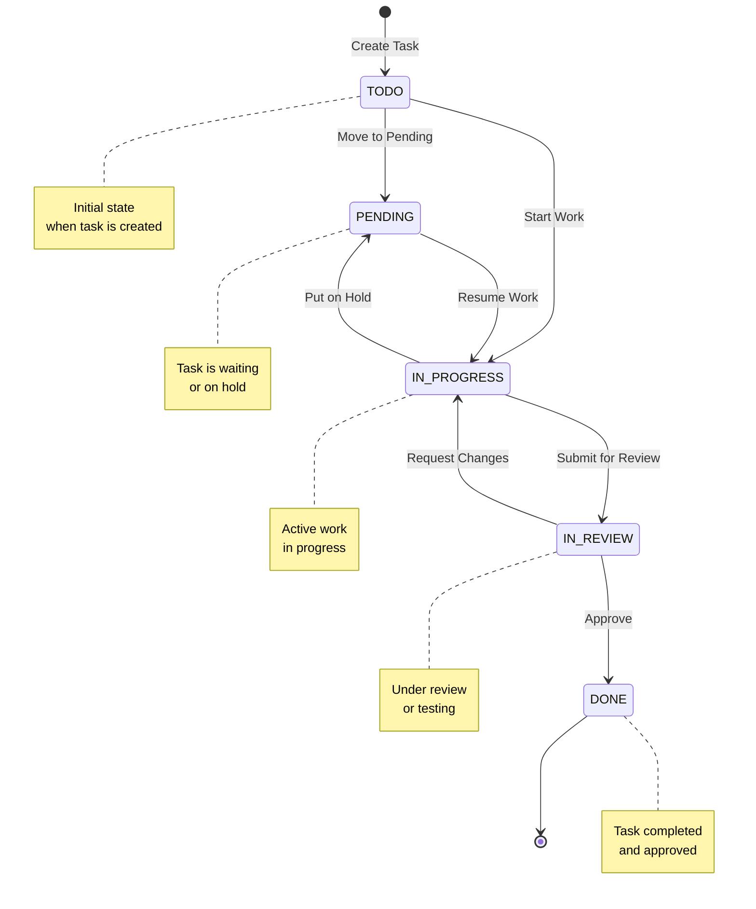
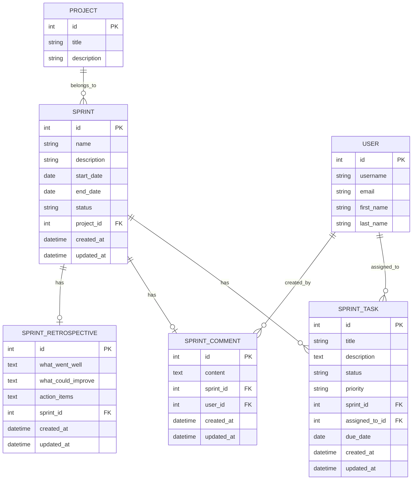
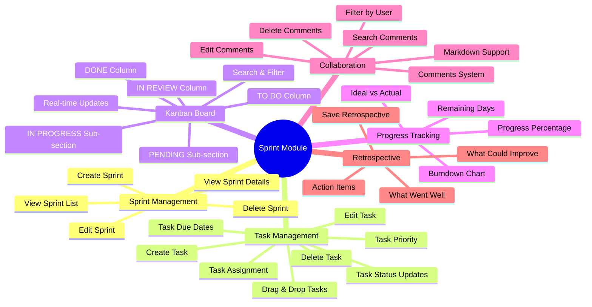
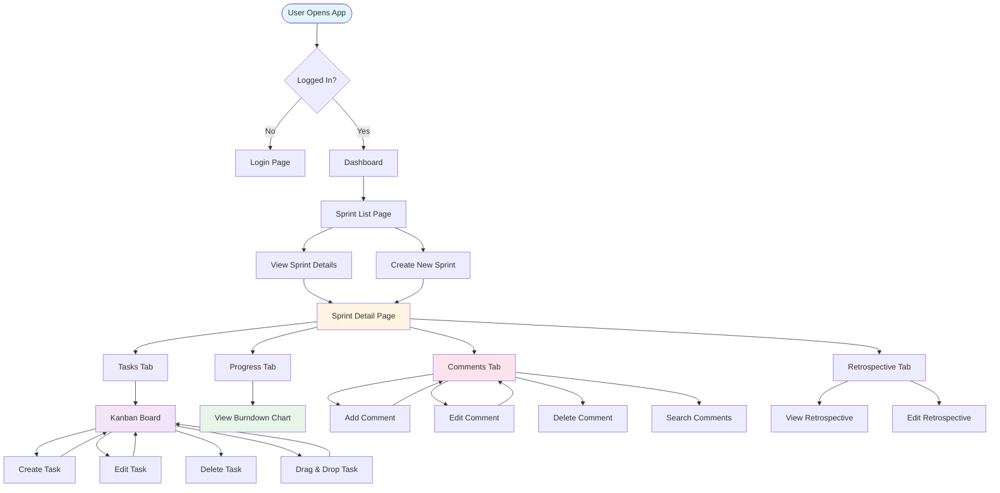

# Sprint Module Architecture Diagram

## Overall Sprint Module Structure



## Component Hierarchy



## Data Flow Diagram



## API Endpoints Structure



## Task Status Flow (Kanban Board)



## Database Schema Relationships



## Feature Breakdown



## User Interaction Flow



## Technology Stack

```mermaid
graph TB
    subgraph "Frontend"
        A[React 19] --> B[Material-UI]
        A --> C[React Router]
        A --> D[dnd-kit]
        A --> E[Axios]
        A --> F[Day.js]
        A --> G[react-markdown]
    end
    
    subgraph "Backend"
        H[Django 4.x] --> I[Django REST Framework]
        I --> J[PostgreSQL]
        I --> K[JWT Authentication]
    end
    
    subgraph "Features"
        L[Drag & Drop] --> D
        M[Real-time Updates] --> A
        N[Markdown Support] --> G
        O[Chart Visualization] --> P[Recharts/Chart.js]
    end
    
    style A fill:#61dafb
    style H fill:#092e20
    style J fill:#336791
```



---

## Key Features Summary

### 1. **Sprint Management**
   - Create, Read, Update, Delete sprints
   - Sprint status tracking (Active, Completed, Upcoming)
   - Sprint duration and progress tracking

### 2. **Task Management**
   - Full CRUD operations for tasks
   - Drag-and-drop task status updates
   - Task assignment to team members
   - Priority levels (High, Medium, Low)
   - Due date tracking with overdue indicators

### 3. **Kanban Board**
   - 5 main columns: TO DO, IN PROGRESS (with PENDING and IN PROGRESS sub-sections), IN REVIEW, DONE
   - Real-time drag-and-drop functionality
   - Search and filter capabilities
   - Task cards with detailed information

### 4. **Progress Tracking**
   - Burndown chart visualization
   - Ideal vs Actual remaining tasks comparison
   - Progress percentage calculation
   - Remaining days calculation

### 5. **Comments System**
   - Add, edit, delete comments
   - Markdown support for rich text
   - Search and filter comments
   - User filtering
   - Auto-refresh functionality

### 6. **Retrospective**
   - What went well section
   - What could improve section
   - Action items tracking
   - Save and update functionality

---

## File Structure

```
frontend/src/
├── pages/Sprints/
│   ├── SprintList.jsx          # Sprint list page
│   └── SprintDetail.jsx        # Sprint detail page
├── components/Sprints/
│   ├── SprintKanbanBoard.jsx   # Kanban board component
│   ├── SprintBurndownChart.jsx # Burndown chart component
│   ├── SprintComments.jsx       # Comments component
│   ├── SprintRetrospective.jsx # Retrospective component
│   ├── CreateTaskModal.jsx     # Create task modal
│   └── EditTaskModal.jsx       # Edit task modal

backend/project_management/sprint/
├── models.py                   # Database models
├── views.py                    # API views
├── serializers.py              # Data serializers
├── urls.py                     # URL routing
└── migrations/                 # Database migrations
```

---

*This diagram provides a comprehensive overview of the Sprint Module architecture, data flow, and component relationships.*

